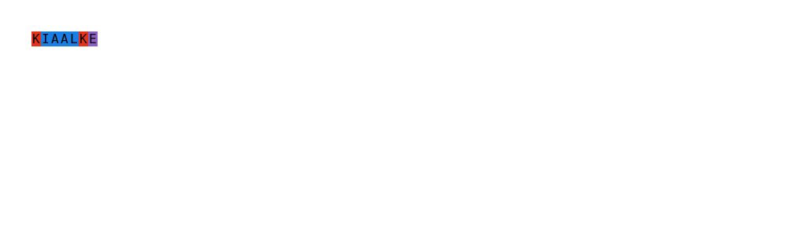

<!-- README.md is generated from README.Rmd. Please edit that file -->

# peptideview

<!-- badges: start -->

<!-- badges: end -->

The goal of peptideview is to visualise peptides sequences.

## Installation

You can install the development version of peptideview with:

``` r
# install.package("remotes)
remotes::install_github("jeanmanguy/peptideview")
```

## Examples

### Coloured peptide sequence in the console

``` r
library(peptideview)

peptide("KIAALKE")
#> KIAALKE
```

It also works in a tibble:

``` r
library(peptideview)

tibble::tibble(sequences = peptide(c("KIAALKE", "KIAVLKE", "EIAALKE")))
#> # A tibble: 3 x 1
#>   sequences
#>   <peptide>
#> 1 KIAALKE  
#> 2 KIAVLKE  
#> 3 EIAALKE
```

(it doesn’t really show here but it works in the console)

### Coloured peptide sequence htmlwidget

``` r
library(peptideview)

view_peptide("KIAALKE")
```


